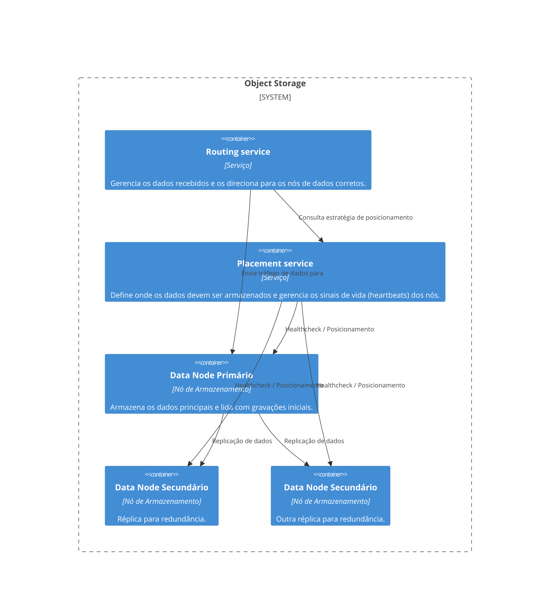

> Este artigo é um trabalho em progresso

Seguindo com nosso Clube do Livro, chegamos ao cápitulo 25 do livro System Design Interview. Neste cápitulo o desafio proposto é o design de um sistema de storage nos moldes de um Amazon S3, um storage de objetos.

Este capítulo nos traz os seguintes requisitos funcionais:

- Criação de buckets
- Upload e download de onjetos
- Versionamento de objetos
- Listar objetos em um bucket

E também os seguintes requisitos não funcionais:

- 100 Petabytes de dados por ano
- Durabilidade de 99,9999%
- Disponibilidade de 99,99%
- Eficiência de storage (reduce storage costs)

Dados os requisitos funcionaos e não-funcionais acima, nossa missão é desenhar este sistema de maneira satisfatória demonstrando nossos conhecimentos de system design e principalmente nossas habilidades de reconhecer trade-offs e tomar decisões assertivas, baseadas neles. 

Porém, neste artigo, não precisamos seguir a risca o script da entrevista como o autor segue no capítulo, já que para isto, bom... temos o livro e o capítulo. Neste artigo vamos passar por um subset de tópicos importantes e interessantes que são abordados, os quais em caso de acabarmos na situação real em que este desafio seja pedido em uma entrevista ou no dia a dia, estejamos preparados.

Vamos abordar:

- Os três tipos de sistemas de armazenamento (storage),
- Terminologia
- O que é "inode" e como este conhecimento pode nos ajudar
- Proposta para armazenamento (Routing e Placement services)
- O trade-off entre latência e consistência referente a quando o dado é considerado salvo com sucesso
- Organização dos dados
- Durabilidade dos dados (Replicas ou Erasure)
- Verificação de integridade dos dados
- Modelo de dados dos meta dados e sharding
- Versionamento dos objetos
- Otimizando o upload de grandes objetos
- Garbage Collection

## Os três tipos de sistemas de sistenas de armazenamento

Antes de entendermos a fundo como funciona um armazenamento de objetos como o S3, é fundamental conhecermos os três tipos principais de sistemas de armazenamento:

- **Block Storage**: é a forma mais primitiva e flexível de armazenamento, onde dados são armazenados em blocos. Ideal para bancos de dados e VMs. Alta performance, mas com maior custo e menor escalabilidade. Block storage veio primeiro, no ano de 1960. HDs e SSD que são tipicamente colocados em servidoes são exemplos de block storage.

- **File Storage**: utiliza block storage por baixo dos panos, mas oferece uma abstração mais amigável com pastas e arquivos. É o que usamos no dia a dia com protocolos como com NFS, SMB, etc. Geralmente usado em ambientes corporativos. Os servidores ou clientes acessando um File Storage não precisam se preocupar em lidar com os blocos em baixo nível.

- **Object Storage**: ideal para grandes volumes de dados não estruturados e de acesso eventual. Não há estrutura hierárquica de pastas; tudo é armazenado como “objetos” com metadados e identificadores únicos. Essa abordagem foca em durabilidade e escala, sacrificando performance.

| Tipo de Armazenamento | Armazenamento em Bloco         | Armazenamento em Arquivo                    | Armazenamento em Objeto                                             |
|------------------------|-------------------------------|---------------------------------------------|---------------------------------------------------------------------|
| Conteúdo Mutável       | Sim                           | Sim                                         | Não (versões são suportadas, mas não há atualização in-place)      |
| Custo                  | Alto                          | Médio a alto                                | Baixo                                                               |
| Performance            | Média a alta, muito alta      | Média a alta                                | Baixa a média                                                       |
| Consistência           | Consistência forte            | Consistência forte                          | Consistência forte                                                  |
| Acesso aos Dados       | SAS / iSCSI / FC              | Acesso padrão a arquivos, CIFS/SMB e NFS    | API RESTful                                                         |
| Escalabilidade         | Escalabilidade média          | Alta escalabilidade                         | Escalabilidade massiva                                              |
| Indicado para          | Máquinas virtuais (VM), aplicações de alta performance como bancos de dados | Acesso a sistemas de arquivos generalistas | Dados binários, dados não estruturados                             |

## Terminologia

- **Bucket**: contêiner lógico de objetos, com nome único global.

- **Object**: dados armazenados em um bucket. Inclui payload (conteúdo) e metadados.

- **URI**: cada objeto/bucket pode ser acessado via URI RESTful.

- **Versionamento**: permite manter múltiplas versões de um mesmo objeto.

- **SLA**: acordos de serviço sobre durabilidade e disponibilidade (ex: 99.9999% de durabilidade).

## O que é "inode" e como esse conhecimento pode nos ajudar

No UNIX, os arquivos são referenciados por inodes, estruturas que armazenam os metadados e apontam para os blocos reais de dados em disco. O inode (Index Node) é armazenado em um local e o arquivo em si é armazenado em outro. Os inodes contem uma lista que aponta para os blocos de dados daquele arquivo no disco fisico.

A arquitetura de sistemas de storage de objetos adota um conceito similar: os meta dados são salvos em locais diferentes dos arquivos, agindo como o inode, guardando informações como UUID, nome do objeto, e bucket e onde está o arquivo; enquanto a data store armazena efetivamente os dados.

Essa separação permite escalar e otimizar cada componente de forma independente, o que também traz benefícios para o design, onde podemos lidar com estes componentes com diferentes designs tambem.

Alguns pontos interessantes sobre os inodes:

- Inodes são estruturas de dados que armaznão todas as informações de um arquivo exceto seu nome e seus dados de fato

- Os inodes arnazenam: Tamanho, Permissão, Owner/Grupo, Localização no disco, data, entre outras informações

- Cada arquivo possui um inode

- O sistema tem limite de inodes, pode ser que você receba uma mensagem de não ter mais espaço em seu HD por causa dos inodes e não por causa do espaço em si

- O número de inodes é decidido na criação do filesystem

- O padrão é 1 inode a cada 2 kilobytes de espaço em disco

Para saber mais sobre inodes acess [Everything You Need to Know About inodes in Linux](https://linuxhandbook.com/inode-linux/) e/ou [Inodes and the Linux filesystem](https://www.redhat.com/en/blog/inodes-linux-filesystem).

## Proposta para Armazenamento: Routing e Placement Services

No design proposto no capítulo, a proposta para :

- **Routing Service**: recebe as requisições e direciona o objeto para o local correto, mas para saber qual o local correto utiliza o serviço de placement que vai lhe fornecer a localização para buscar ou gravar dados.

- **Placement Service**: define, via mapa virtual do cluster, para onde os dados devem ir, garantindo separação física (por rack, AZ, etc.) para aumentar a durabilidade. Este serviço mantem uma árvore que serve de mapa entre os data centers, AZs, clusters e partições, e sempre se mantém atualizado quanto a saúde destes nós. Fornece as informação de onde o serviço de routing pode enviar novos dados ou buscar dados.

- **Nós de dados / Data Nodes**: São os serviços que de fato guardam os dados, trabalhando durabilidade e confiabilidade através de replicação entre os nós primários e secundários.
    - As mensagens de heartbeat incluem:
        - Quantos discos o nó possui
        - Quanto de dados já está em cada disco
    - Quando o placement service recebe pela primeira vez um hearbeat, ele registra o novo nó e retorna:
        - ID único para o nó
        - O mapa virtual do cluster
        - Aonde deve replicar

Esse modelo distribui dados em múltiplos nós, com um primário e replicações secundárias, garantindo resiliência contra falhas.

O design dos serviços e componentes ficaria assim:

Enquanto um exemplo do mapa que o Placement Service mantém em memória é:

## O trade-off entre latência e consistência

No tópico acima falamos sobre a replicação dos dados, e isso sempre levanta uma questão: "Quando podemos considerar um dado salvo? Quando salvamos no nó primário? Quando está replicado em todos os nós?"

Esta pergunta depende de como nosso sistema pode lidar com alguns trade-offs, e qual o requisito não funcional mais importante entre latência e consistência. 

Abaixo alguns níveis de como podemos considerar os dados "salvos com sucesso":

- **Após replicar em todos os nós**: maior consistência, maior latência

- **Após replicar em 2 de 3 nós**: trade-off médio entre consistência e performance

- **Apenas após escrita no nó primário** baixa latência, consistência eventual

Esses trade-offs são importantes e devem ser alinhados com os requisitos do sistema.

## Organização dos Dados

Salvar cada objeto como um arquivo independente pode ser ineficiente (especialmente para objetos pequenos). Para isso, usamos a técnica de agregação:

Objetos pequenos são gravados sequencialmente em um arquivo grande (estilo WAL).

- Um banco de metadados local mapeia UUIDs para offset/tamanho dentro do arquivo.

- Para performance, arquivos “read-write” são rotacionados para “read-only” quando cheios.

## Durabilidade dos Dados: Replicas ou Erasure Coding?

- Replicação (x3): simples de implementar, baixa latência, ~6 noves de durabilidade, mas com 200% de overhead.

- Erasure Coding (ex: 8+4): aumenta durabilidade (~11 noves), reduz overhead (50%), mas adiciona latência e complexidade para leitura e escrita.

Para sistemas sensíveis à latência, replicação ainda é a escolha mais comum.

## Verificação de Integridade dos Dados

Mesmo dados replicados podem sofrer corrupção silenciosa. Por isso, o sistema adiciona checksums (ex: MD5) ao final de cada objeto.

Antes de retornar um objeto ao cliente, o checksum é recalculado e comparado ao original. Se estiver errado, tenta-se recuperar de outra réplica.

## Modelo de Dados dos Metadados e Sharding

Dois modelos principais:

- Tabela de Buckets: pequena, pode ficar em um único banco com réplicas para leitura.

- Tabela de Objetos: precisa ser particionada. O ideal é usar um hash de (bucket_name, object_name) para sharding, o que distribui bem e permite buscar por URI.

Para listar objetos por prefixo, é necessário agrupar resultados em múltiplos shards, o que complica a paginação. Uma solução é desnormalizar os dados de listagem em outra tabela, focada apenas nisso.

## Versionamento dos Objetos

Com versionamento habilitado:

- Toda nova versão insere uma nova linha na tabela de metadados com object_version (TIMEUUID).

- Deleções adicionam um delete marker, e não removem dados anteriores.

- O GET busca sempre a versão mais recente (maior UUID).

## Otimizando o Upload de Grandes Objetos

Para grandes objetos (multi-GB):

- Usa-se Multipart Upload.

- O cliente quebra o arquivo em partes (ex: 8x200MB), envia cada parte, e depois envia uma requisição de “complete”.

- O sistema monta o objeto final com base no uploadID.

## Garbage Collection

O sistema marca objetos como deletados (ou versões antigas) mas não os remove de imediato.

A garbage collection periodicamente:

- Reescreve arquivos com objetos válidos em novos arquivos compactados.

- Atualiza os offsets no banco de metadados.

- Remove partes antigas de multipart uploads ou uploads abandonados.

## Conclusão

[WIP]