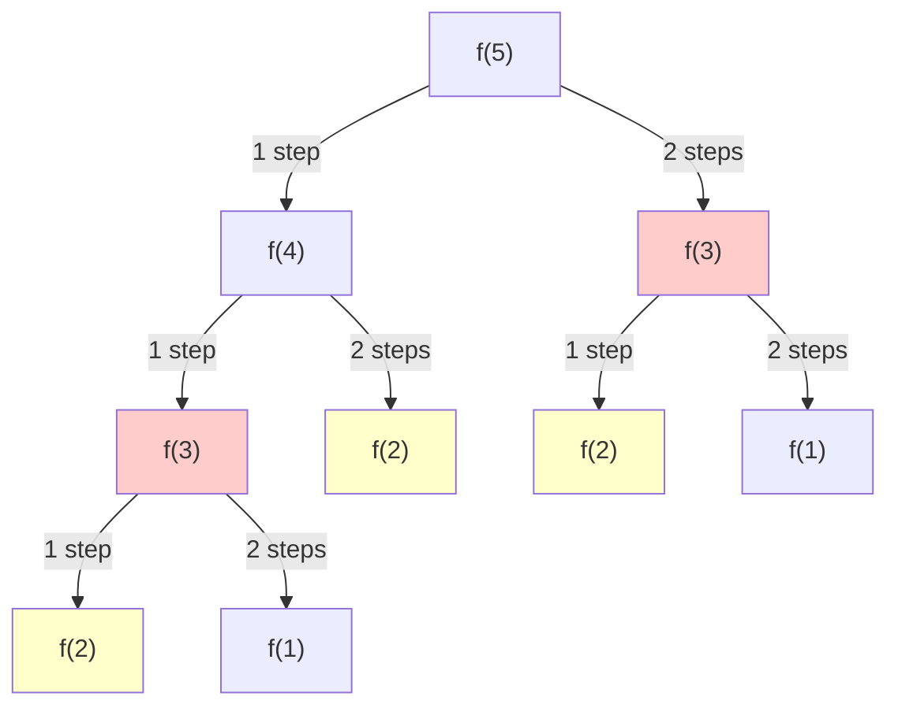

## Introdução

**Programação Dinâmica** (DP) é uma técnica de otimização introduzida por **Richard Bellman** na década de 1950. O nome "programação" não se refere a código, mas sim ao planejamento matemático de decisões — um termo comum na época. A técnica resolve problemas complexos dividindo-os em subproblemas menores e **armazenando os resultados** para evitar cálculos repetidos.

No encontro anterior, aprendemos **Backtracking** — uma técnica que explora todas as soluções possíveis, construindo caminhos e retrocedendo quando necessário. Backtracking é poderoso para **enumerar** soluções, mas quando queremos apenas **contar** quantas soluções existem ou encontrar a **solução ótima** (mínimo/máximo), podemos usar uma abordagem mais eficiente.

A Programação Dinâmica transforma algoritmos exponenciais em algoritmos polinomiais através de uma ideia simples: **nunca calcule a mesma coisa duas vezes**.

## Quando usar Programação Dinâmica?

DP requer duas propriedades fundamentais:

| Propriedade | Significado | Exemplo |
| --- | --- | --- |
| **Subproblemas sobrepostos** | O mesmo subproblema é resolvido múltiplas vezes | Fibonacci: `f(3)` é calculado várias vezes ao calcular `f(5)` |
| **Subestrutura ótima** | A solução ótima é construída a partir de soluções ótimas dos subproblemas | Caminho mínimo: o menor caminho de A→C passa pelo menor caminho de A→B |

## Backtracking vs Recursão vs Programação Dinâmica

Antes de avançar, é importante entender a diferença entre essas técnicas:

| Técnica | O que faz | Quando usar |
| --- | --- | --- |
| **Backtracking** | Constrói soluções explicitamente, desfaz escolhas | Enumerar TODAS as soluções (subsets, permutações) |
| **Recursão** | Resolve problema chamando a si mesmo com entrada menor | Definição matemática direta (Fibonacci) |
| **Programação Dinâmica** | Recursão + cache de resultados | CONTAR soluções ou encontrar ÓTIMO (min/max) |

### Exemplo prático: Climbing Stairs

**Problema:** Você está subindo uma escada com `n` degraus. Pode subir 1 ou 2 degraus por vez. De quantas formas distintas você pode chegar ao topo?

**Com Backtracking (enumerar todos os caminhos):**

```javascript
function climbStairs(n) {
  const allPaths = [];
  
  function backtrack(currentStep, path) {
    if (currentStep === n) {
      allPaths.push([...path]);  // armazena solução completa
      return;
    }
    if (currentStep > n) return;  // inválido, podar
    
    for (const step of [1, 2]) {
      path.push(step);                      // adiciona escolha
      backtrack(currentStep + step, path);  // recursão
      path.pop();                           // remove escolha (backtrack)
    }
  }
  
  backtrack(0, []);
  return allPaths;  // retorna [[1,1,1], [1,2], [2,1]] para n=3
}
```

**Com Recursão (apenas contar):**

```javascript
function climbStairs(n) {
  if (n <= 1) return 1;
  return climbStairs(n - 1) + climbStairs(n - 2);
}
```

Perceba: quando só precisamos **contar**, não precisamos construir os caminhos explicitamente. Mas essa recursão tem um problema...

## O Problema da Recursão Ingênua

Vamos visualizar a árvore de recursão para `climbStairs(5)`:



Note que `f(3)` é calculado 2 vezes, `f(2)` é calculado 3 vezes. Para valores maiores de `n`, essa repetição explode exponencialmente.

| n | Chamadas sem cache | Chamadas com cache |
| --- | --- | --- |
| 10 | 177 | 10 |
| 20 | 21.891 | 20 |
| 30 | 2.692.537 | 30 |
| 40 | 331.160.281 | 40 |

**Complexidade sem cache:** O(2ⁿ) — exponencial

**Complexidade com cache:** O(n) — linear

## As Duas Abordagens de DP

### Top-Down (Memoização)

A abordagem **Top-Down** mantém a estrutura recursiva original e adiciona um cache para armazenar resultados já calculados.

**Intuição:** "Começo do problema original e vou descendo. Se já calculei um subproblema, apenas retorno o resultado salvo."

```javascript
function climbStairs(n, memo = new Map()) {
  if (n <= 1) return 1;
  
  if (memo.has(n)) return memo.get(n);  // já calculamos isso!
  
  const result = climbStairs(n - 1, memo) + climbStairs(n - 2, memo);
  memo.set(n, result);  // salva para uso futuro
  
  return result;
}
```

**Tempo:** O(n) — cada subproblema calculado uma vez
**Espaço:** O(n) — memo + call stack

### Bottom-Up (Tabulação)

A abordagem **Bottom-Up** inverte a direção: começamos dos casos base e construímos a solução iterativamente.

**Intuição:** "Se eu já sei a ordem dos subproblemas, por que usar recursão? Posso simplesmente preencher uma tabela do início ao fim."

```javascript
function climbStairs(n) {
  if (n <= 1) return 1;
  
  const dp = new Array(n + 1);
  dp[0] = 1;
  dp[1] = 1;
  
  for (let i = 2; i <= n; i++) {
    dp[i] = dp[i - 1] + dp[i - 2];
  }
  
  return dp[n];
}
```

**Tempo:** O(n)
**Espaço:** O(n) — mas sem overhead de recursão

### Otimização de Espaço

Observe que para calcular `dp[i]`, precisamos apenas de `dp[i-1]` e `dp[i-2]`. Por que manter o array inteiro?

```javascript
function climbStairs(n) {
  if (n <= 1) return 1;
  
  let prev2 = 1;
  let prev1 = 1;
  
  for (let i = 2; i <= n; i++) {
    const current = prev1 + prev2;
    prev2 = prev1;
    prev1 = current;
  }
  
  return prev1;
}
```

**Tempo:** O(n)
**Espaço:** O(1) — apenas duas variáveis!

## Top-Down vs Bottom-Up

| Fator | Top-Down (Memoização) | Bottom-Up (Tabulação) |
| --- | --- | --- |
| **Estrutura** | Recursiva | Iterativa |
| **Overhead de recursão** | Sim (custo de chamadas) | Não |
| **Risco de stack overflow** | Sim (recursão profunda) | Não |
| **Localidade de cache** | Ruim (pula na memória) | Boa (acesso sequencial) |
| **Calcula todos os subproblemas** | Não (apenas necessários) | Sim (preenche tabela inteira) |
| **Otimização de espaço** | Mais difícil | Mais fácil |
| **Facilidade de implementação** | Geralmente mais intuitiva | Requer entender ordem dos subproblemas |
| **Melhor quando** | Espaço de estados esparso, terminação antecipada | Espaço denso, performance crítica |

## Problema Clássico: Coin Change

**Problema:** Dado um array de moedas `coins` e um valor `amount`, retorne o menor número de moedas necessárias para formar esse valor. Se não for possível, retorne -1.

**Exemplo:** `coins = [1, 3, 4]`, `amount = 6` → Resposta: `2` (3 + 3)

### Backtracking (Exponencial)

```javascript
function coinChange(coins, amount) {
  if (amount === 0) return 0;
  if (amount < 0) return Infinity;
  
  let minCoins = Infinity;
  
  for (const coin of coins) {
    const result = coinChange(coins, amount - coin);
    minCoins = Math.min(minCoins, result + 1);
  }
  
  return minCoins;
}
```

**Tempo:** O(kⁿ) onde k = número de moedas

### Top-Down com Memoização

```javascript
function coinChange(coins, amount, memo = new Map()) {
  if (amount === 0) return 0;
  if (amount < 0) return Infinity;
  
  if (memo.has(amount)) return memo.get(amount);
  
  let minCoins = Infinity;
  
  for (const coin of coins) {
    const result = coinChange(coins, amount - coin, memo);
    minCoins = Math.min(minCoins, result + 1);
  }
  
  memo.set(amount, minCoins);
  return minCoins;
}

// Uso:
const result = coinChange([1, 3, 4], 6);
console.log(result === Infinity ? -1 : result);  // 2
```

**Tempo:** O(amount × coins)
**Espaço:** O(amount)

### Bottom-Up com Tabulação

```javascript
function coinChange(coins, amount) {
  const dp = new Array(amount + 1).fill(Infinity);
  dp[0] = 0;
  
  for (let i = 1; i <= amount; i++) {
    for (const coin of coins) {
      if (coin <= i) {
        dp[i] = Math.min(dp[i], dp[i - coin] + 1);
      }
    }
  }
  
  return dp[amount] === Infinity ? -1 : dp[amount];
}
```

**Tempo:** O(amount × coins)
**Espaço:** O(amount)

## DP 1D vs DP 2D

A "dimensão" do DP refere-se a **quantas variáveis definem um subproblema**.

| Dimensão | Estado | Exemplos |
| --- | --- | --- |
| **1D** | `dp[i]` — uma variável | Fibonacci, Climbing Stairs, Coin Change, House Robber |
| **2D** | `dp[i][j]` — duas variáveis | Unique Paths, LCS, Edit Distance, Knapsack |
| **3D+** | `dp[i][j][k]...` — três ou mais | Knapsack com múltiplas restrições |

## Problema 2D: Unique Paths

**Problema:** Um robô está em um grid `m x n`, começando no canto superior esquerdo. Ele só pode se mover para baixo ou para a direita. De quantas formas distintas ele pode chegar ao canto inferior direito?

**Exemplo:** `m = 3`, `n = 3` → Resposta: `6`

```
┌───┬───┬───┐ 
│ S │ → │   │ 
├───┼───┼───┤ 
│ ↓ │   │   │ 
├───┼───┼───┤
│   │   │ E │ 
└───┴───┴───┘ 
```

### Backtracking (Exponencial)

```javascript
function uniquePaths(m, n) {
  function backtrack(row, col) {
    if (row === m - 1 && col === n - 1) return 1;  // chegou!
    if (row >= m || col >= n) return 0;             // fora do grid
    
    const goDown = backtrack(row + 1, col);
    const goRight = backtrack(row, col + 1);
    
    return goDown + goRight;
  }
  
  return backtrack(0, 0);
}
```

**Tempo:** O(2^(m+n)) — cada célula ramifica em duas escolhas

### Top-Down com Memoização

```javascript
function uniquePaths(m, n) {
  const memo = new Map();
  
  function backtrack(row, col) {
    if (row === m - 1 && col === n - 1) return 1;
    if (row >= m || col >= n) return 0;
    
    const key = `${row},${col}`;
    if (memo.has(key)) return memo.get(key);
    
    const result = backtrack(row + 1, col) + backtrack(row, col + 1);
    memo.set(key, result);
    
    return result;
  }
  
  return backtrack(0, 0);
}
```

**Tempo:** O(m × n) — cada célula calculada uma vez
**Espaço:** O(m × n) memo + O(m + n) call stack

### Bottom-Up com Tabulação

```javascript
function uniquePaths(m, n) {
  const dp = Array(m).fill(null).map(() => Array(n).fill(0));
  
  // Primeira linha: só uma forma de chegar (indo para direita)
  for (let j = 0; j < n; j++) dp[0][j] = 1;
  
  // Primeira coluna: só uma forma de chegar (indo para baixo)
  for (let i = 0; i < m; i++) dp[i][0] = 1;
  
  // Preencher o resto
  for (let i = 1; i < m; i++) {
    for (let j = 1; j < n; j++) {
      dp[i][j] = dp[i - 1][j] + dp[i][j - 1];  // de cima + da esquerda
    }
  }
  
  return dp[m - 1][n - 1];
}
```

**Tempo:** O(m × n)
**Espaço:** O(m × n)

**Visualização do preenchimento:**

```
┌───┬───┬───┬───┐
│ 1 │ 1 │ 1 │ 1 │
├───┼───┼───┼───┤
│ 1 │ 2 │ 3 │ 4 │
├───┼───┼───┼───┤
│ 1 │ 3 │ 6 │ 10│
└───┴───┴───┴───┘
```

### Otimização de Espaço (2D → 1D)

```javascript
function uniquePaths(m, n) {
  const dp = Array(n).fill(1);
  
  for (let i = 1; i < m; i++) {
    for (let j = 1; j < n; j++) {
      dp[j] = dp[j] + dp[j - 1];  // dp[j] (de cima) + dp[j-1] (da esquerda)
    }
  }
  
  return dp[n - 1];
}
```

**Tempo:** O(m × n)
**Espaço:** O(n) — apenas uma linha por vez!

## Tabela de Evolução: 1D vs 2D

### Problemas 1D

| Abordagem | Climbing Stairs | Coin Change |
| --- | --- | --- |
| **Backtracking** | `climb(n-1) + climb(n-2)` | `min(change(amt - coin) + 1)` |
| **Top-Down** | + `memo.set(n, result)` | + `memo.set(amount, result)` |
| **Bottom-Up** | `dp[i] = dp[i-1] + dp[i-2]` | `dp[i] = min(dp[i], dp[i-coin] + 1)` |
| **Otimizado** | `curr = prev1 + prev2` | Não possível (precisa de todos os estados anteriores) |
| **Tempo** | O(2ⁿ) → O(n) | O(kⁿ) → O(n × k) |
| **Espaço** | O(n) → O(1) | O(n) |

### Problemas 2D

| Abordagem | Unique Paths |
| --- | --- |
| **Backtracking** | `paths(row+1, col) + paths(row, col+1)` |
| **Top-Down** | + `memo.set(\`${row},${col}\`, result)` |
| **Bottom-Up** | `dp[i][j] = dp[i-1][j] + dp[i][j-1]` |
| **Otimizado** | `dp[j] = dp[j] + dp[j-1]` (1D array) |
| **Tempo** | O(2^(m+n)) → O(m × n) |
| **Espaço** | O(m × n) → O(n) |

## Outros Problemas Clássicos de DP

| Problema | Dimensão | Transição de Estado | Aplicações Reais |
| --- | --- | --- | --- |
| **Fibonacci** | 1D | `f(n) = f(n-1) + f(n-2)` | Modelagem de crescimento, padrões na natureza |
| **Climbing Stairs** | 1D | `dp[i] = dp[i-1] + dp[i-2]` | Contagem de combinações em decisões sequenciais |
| **House Robber** | 1D | `dp[i] = max(dp[i-1], dp[i-2] + nums[i])` | Alocação de recursos com restrições, agendamento de jobs não-conflitantes |
| **Coin Change** | 1D | `dp[amt] = min(dp[amt - coin] + 1)` | Sistemas de troco, provisionamento de recursos |
| **Longest Common Subsequence** | 2D | Match: `dp[i-1][j-1] + 1`, No match: `max(dp[i-1][j], dp[i][j-1])` | Git diff, alinhamento de DNA, detecção de plágio |
| **Edit Distance** | 2D | Match: `dp[i-1][j-1]`, No match: `1 + min(replace, delete, insert)` | Corretor ortográfico, autocomplete, OCR |
| **Unique Paths** | 2D | `dp[i][j] = dp[i-1][j] + dp[i][j-1]` | Navegação de robôs, roteamento de pacotes |
| **0/1 Knapsack** | 2D | `max(skip, take)` | Alocação de orçamento, otimização de portfólio, carregamento de carga |
| **Minimum Path Sum** | 2D | `dp[i][j] = grid[i][j] + min(dp[i-1][j], dp[i][j-1])` | GPS/navegação, otimização de latência de rede |

## Complexidade Assintótica

### O que significa cada complexidade?

| Nome | Notação | Padrão de Crescimento | Aceitável? |
| --- | --- | --- | --- |
| **Constante** | O(1) | Mesmo tempo independente da entrada | ✓ Ideal |
| **Logarítmico** | O(log n) | Divide pela metade a cada passo | ✓ Excelente |
| **Linear** | O(n) | Proporcional à entrada | ✓ Ótimo |
| **Linearítmico** | O(n log n) | Linear × logarítmico | ✓ Bom |
| **Quadrático** | O(n²) | Loops aninhados | ⚠️ Ok para n pequeno |
| **Cúbico** | O(n³) | Três loops aninhados | ⚠️ Apenas n pequeno |
| **Exponencial** | O(2ⁿ) | Dobra a cada passo | ✗ Evitar se possível |
| **Fatorial** | O(n!) | Todas as permutações | ✗ Apenas entradas minúsculas |

### Comparação Prática

Assumindo 1 bilhão de operações por segundo:

| Complexidade | n = 20 | n = 40 | n = 100 |
| --- | --- | --- | --- |
| **O(n)** | 0.00002 ms | 0.00004 ms | 0.0001 ms |
| **O(n log n)** | 0.00009 ms | 0.0002 ms | 0.0007 ms |
| **O(n²)** | 0.0004 ms | 0.0016 ms | 0.01 ms |
| **O(2ⁿ)** | 1 ms | 18 minutos | 40 trilhões de anos |

## Apêndice

### Backtracking vs DP vs Greedy

| Aspecto | Backtracking | Programação Dinâmica | Greedy |
| --- | --- | --- | --- |
| **Estratégia** | Tenta tudo, desfaz e retenta | Resolve subproblemas uma vez, reutiliza | Faz melhor escolha local, nunca volta |
| **Explora** | Todos os caminhos possíveis | Todos os subproblemas (cada um uma vez) | Caminho único |
| **Garante ótimo?** | Sim (exaustivo) | Sim (se tiver subestrutura ótima) | Às vezes (só para problemas específicos) |
| **Reconsidera escolhas?** | Sim (backtrack) | Sim (compara opções) | Nunca |
| **Complexidade de tempo** | Geralmente exponencial | Geralmente polinomial | Geralmente linear ou O(n log n) |

### Qual a diferença entre o "0/1" do Knapsack?

O "0/1" refere-se à escolha binária para cada item: você **pega (1)** ou **deixa (0)**. Não há meio-termo.

| Variante | Regra de Seleção | Exemplo |
| --- | --- | --- |
| **0/1 Knapsack** | Cada item: pega uma vez ou não pega | Arrumando mala — ou leva o laptop ou não |
| **Unbounded Knapsack** | Pode pegar qualquer item ilimitadamente | Comprando no supermercado — pode comprar 10 do mesmo |
| **Bounded Knapsack** | Cada item disponível até `k` vezes | Estoque limitado — 5 unidades do item A |
| **Fractional Knapsack** | Pode pegar fração de um item | Carregando grãos — pode levar meio saco |

### Quando cada técnica é melhor?

| Objetivo | Técnica |
| --- | --- |
| Listar TODAS as soluções | Backtracking |
| CONTAR soluções | DP |
| Encontrar ÓTIMO (min/max) | DP |
| Problema com "greedy-choice property" | Greedy |
| Satisfação de restrições | Backtracking |

## Referências

* [Repositório com exemplos do encontro](https://github.com/giovannymassuia/DS-A/tree/main/node-dsa/dynamic-programming)
* [Dynamic Programming - Wikipedia](https://en.wikipedia.org/wiki/Dynamic_programming)
* [Jeff Erickson Algorithms](https://jeffe.cs.illinois.edu/teaching/algorithms/)
  + [Dynamic Programming - Jeff Erickson](https://jeffe.cs.illinois.edu/teaching/algorithms/book/03-dynprog.pdf)
* [Dynamic Programming - GeeksforGeeks](https://www.geeksforgeeks.org/dynamic-programming/)
* LeetCode
  + [70. Climbing Stairs (easy)](https://leetcode.com/problems/climbing-stairs/)
  + [509. Fibonacci Number (easy)](https://leetcode.com/problems/fibonacci-number/)
  + [198. House Robber (medium)](https://leetcode.com/problems/house-robber/)
  + [322. Coin Change (medium)](https://leetcode.com/problems/coin-change/)
  + [62. Unique Paths (medium)](https://leetcode.com/problems/unique-paths/)
  + [1143. Longest Common Subsequence (medium)](https://leetcode.com/problems/longest-common-subsequence/)
  + [72. Edit Distance (medium)](https://leetcode.com/problems/edit-distance/)
  + [416. Partition Equal Subset Sum (medium)](https://leetcode.com/problems/partition-equal-subset-sum/) — variação do Knapsack
