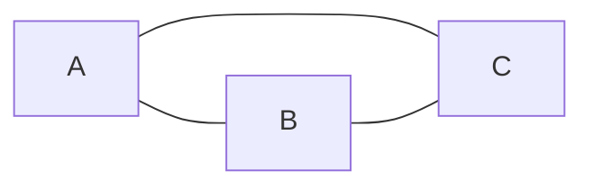
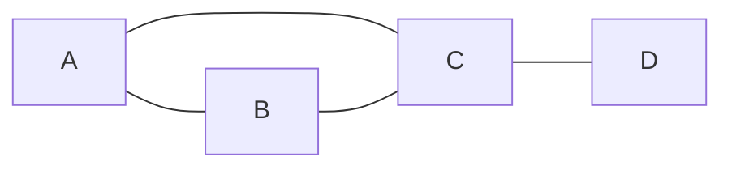
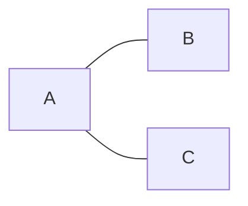
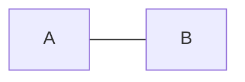
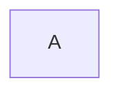
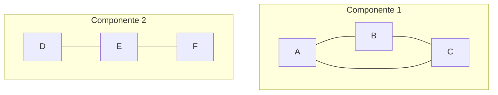

## O que é uma MST?

A MST (*Minimum Spanning Tree*) é a solução para um problema clássico de otimização em grafos.

- Uma MST não é uma estrutura de dados, nem um algoritmo específico.
- Trata-se de uma categoria de problema, mais precisamente um problema de minimização em grafos não direcionados, conexos e ponderados


### Onde aplicar?

#### Exemplo 1

Imagine que precisamos conectar vários pontos, como cidades, computadores, roteadores ou sensores, com o menor custo possível.
Esse é, em essência, o **problema da MST**.


#### Exemplo 2

Imagine que você é um engenheiro civil responsável por construir estradas entre várias cidades. Todas devem estar conectadas, e cada estrada tem um custo. O objetivo é:

- Conectar todas as cidades;
- Minimizar o custo total;
- Evitar construções desnecessárias (ou seja, sem redundância);

Este é um exemplo clássico do problema da MST.


### Aplicações práticas

As MSTs são úteis em cenários onde:


- Todos os pontos precisam estar conectados, sem vértices isolados
- O objetivo é minimizar o custo total das conexões;
- Ciclos são indesejáveis, por razões de simplicidade, eficiência ou economia;

### Outras aplicações

- Projeto de redes elétricas, com o objetivo de minimizar o custo da fiação;
- Planeamento de rotas para entregas, ferrovias, tubulações ou redes de fibra óptica;
- Redução de custos em grafos de similaridade, usados em técnicas de agrupamento (*clustering*) em Machine Learning, como o MST-based clustering;


## Características

Uma **Minimum Spanning Tree (MST)** é um subconjunto das arestas de um **grafo conexo, não direcionado e ponderado** que:

- Conecta todos os vértices do grafo (ou seja, forma uma *árvore geradora*);
- Não contém ciclos;
- Minimiza a soma dos pesos das arestas;
- Se o grafo tiver **V vértices**, a MST terá **V-1 arestas**, pois é uma **árvore**;


## Grafo vs Árvore

### Grafo

Um grafo é uma estrutura composta por vértices (ou nós) e arestas (conexões entre os vértices).

**Tipos de grafos**

- Direcionado vs. Não direcionado;
- Ponderado (com pesos) vs. Não ponderado;
- Cíclico vs. Acíclico;
- Conexo vs. Desconexo;

**Grafo genérico pode conter**

- Ciclos (ex.: A — B — C — A);
- Componentes desconexos;
- Laços (auto-conexões);
- Múltiplas arestas entre os mesmos vértices (multigrafo);

**Exemplos**





### Árvore

Uma árvore é um tipo específico de grafo, com restrições adicionais.

**Características**

- **Conectado**: há caminho entre todos os vértices.
- **Acíclico**: **não possui ciclos**.
- Se possui V vértices, terá exatamente V-1 arestas.

**Exemplos**







| **Característica**          | **Grafo**                                                                  | **Árvore**                                                 |
| --------------------------- | ---------------------------------------------------------------------------| ---------------------------------------------------------- |
| **Ciclos**                  | Pode ter ciclos (caminhos que começam e terminam no mesmo vértice)         | Não contém ciclos (é acíclica)                             |
| **Conexão**                 | Pode ser conexo (um único componente) ou desconexo (múltiplos componentes) | Sempre conexa (todos os vértices são alcançáveis)          |
| **Número de Arestas**       | Qualquer número de arestas, dependendo do grafo                            | Exatamente **V-1** arestas, onde V é o número de vértices  |
| **Estrutura**               | Geral, sem restrições (pode ser densa, esparsa, etc.)                      | Hierárquica, com um vértice raiz (em árvores enraizadas)   |
| **Caminhos entre Vértices** | Pode haver múltiplos caminhos entre dois vértices                          | Existe exatamente **um único caminho** entre dois vértices |

**Nota:** Toda árvore é um grafo, mas nem todo grafo é uma árvore.


### Árvore geradora (Spanning Tree)

Uma **árvore geradora** de um grafo G é qualquer subconjunto de arestas de G que:

- Conecta todos os vértices;
- Não possui ciclos;
- Tem exatamente V-1 arestas, onde V é o número de vértices do grafo.

**Importante:** Um grafo pode ter **muitas árvores geradoras diferentes**!

#### Árvore Geradora Mínima (Minimum Spanning Tree – MST)

Conectada, acíclica e de custo mínimo. A **árvore geradora mínima** é **uma árvore geradora específica** que:

- Conecta todos os vértices,
- Tem o menor custo total possível (soma dos pesos das arestas).

**Nota:** todas as MSTs são árvores geradoras, mas nem toda árvore geradora é mínima.

| Conceito                   | Spanning Tree    | Minimum Spanning Tree (MST)                                |
| -------------------------- | ---------------- | ---------------------------------------------------------- |
| Conecta todos os vértices? | ✅ Sim           | ✅ Sim                                                    |
| Tem V-1 arestas?           | ✅ Sim           | ✅ Sim                                                    |
| Pode ter ciclos?           | ❌ Não           | ❌ Não                                                    |
| Considera pesos?           | ❌ Não           | ✅ Sim                                                    |
| Quantas existem?           | Muitas possíveis | Pode haver mais de uma, mas todas com o mesmo custo mínimo |
| Objetivo                   | Apenas conectar  | Conectar com menor custo                                   |


### Grafos não direcionados

Para percebermos este conceito, vamos olhar novamente para o conceito de árvore geradora. Uma árvore geradora é um subconjunto de um grafo que garante conexão entre todos os vértices. Com base nesta definição vamos olhar estes casos. `A — B` (em um grafo não direcionado) versus `A -> B` (em um grafo direcionado). No caso direcionado, temos ligação entre `A` e `B`, mas não temos ligação de `B` para `A`. Ou seja, se o grafo for direcionado, ao partirmos de um vértice arbitrário, podemos não alcançar todos os demais vértices, logo, nem todos estariam conectados. Portanto, não é uma árvore no sentido clássico, pois não há simetria na conexão.
Resumindo, MST só fará sentido em grafos não direcionados.

#### Minimum spanning arborescence

Se estivermos lidando com grafos direcionados, o conceito equivalente seria *arborescência* ou Minimum Spanning Arborescence (ou Directed MST). [Arborescence (graph theory)](https://en.wikipedia.org/wiki/Arborescence_(graph_theory))


### Grafos conexos

Mais uma vez, o objetivo de uma MST é conectar todos os vértices com custo mínimo e sem formar ciclos. Por essa mesma razão, é uma característica essencial que todos os vértices estejam conectados.


### Minimum Spanning Forest

Se o grafo não for conexo, não existe MST, nesse caso, podemos falar de **Minimum Spanning Forest**, que é uma união de MSTs por componente conexa, ou seja, temos uma floresta geradora mínima.

- Uma **MST para cada componente conexo**.
- Cada árvore cobre uma parte do grafo isoladamente.


[Exemplo adicional](https://www.w3schools.com/dsa/dsa_algo_mst_kruskal.php)


### Grafo ponderado

Uma MST é a solução para um problema de otimização, ou seja, encontrar o custo mínimo para conectar todos os vértices de um grafo. Caso um grafo não tenha ponderação, isso significa que todas as arestas terão o mesmo peso no momento da escolha.

Em outras palavras, se não houver ponderação nas arestas, no máximo teremos uma árvore geradora, mas não conseguimos determinar a árvore geradora mínima, pois não há critério para comparação. Consequentemente, não há otimização possível.


## Definição formal

Subgrafo acíclico que conecta todos os vértices de um grafo.

- **Entrada:** um grafo G = (V, E), não direcionado, ponderado, conexo.
- **Objetivo:** encontrar subconjunto E′ de E tal que:
  - |E′| = |V| - 1 (formando uma árvore),
  - A soma dos pesos das arestas em E′ é mínima.


## Algoritmos

Imagine que temos ilhas (vértices) e possíveis pontes (arestas com custo) para ligá-las. Nosso objetivo é ligar todas as ilhas com o menor custo possível, sem formar ciclos (ou seja, sem construir pontes desnecessárias).


### Kruskal

**Modo de agir**:

O algoritmo funciona como um engenheiro que escolhe a ponte mais barata. Pega a lista de todas as pontes possíveis, ordena da mais barata à mais cara, e vai ligando as ilhas, uma a uma, sem criar ilhas com pontes redundantes (ciclos).

**Características**:
- Foi publicado pela primeira vez em 1956 por Joseph Kruskal;
- Técnica de Greedy;
- Ordena arestas e adiciona se não formar ciclo (Union-Find).
- Uso de estruturas de dados: Disjoint Set (Union-Find com path compression).
- Complexidade:
  - O(E log E) para ordenar as arestas, onde E é o número de arestas
  - Na prática, como E pode ser no máximo V², onde V é o número de vértices, podemos reescrever como O(E log V)
  - Usa Union-Find (DSU) para evitar ciclos:
    - Union-Find: quase O(1) por operação com heurísticas (path compression e union by rank)
    - Total: O(E log V)
- Bom para grafos esparsos

**Pseudocódigo**:
```
KRUSKAL(G):
  A = ∅  // conjunto de arestas que formará a MST
  para cada vértice v em G.V:
    MAKE-SET(v)  // cria um conjunto para cada vértice
  ordenar G.E por peso crescente  // E são as arestas do grafo
  para cada aresta (u, v) em G.E (em ordem de peso crescente):
    se FIND-SET(u) ≠ FIND-SET(v):  // se u e v estão em componentes diferentes
      A = A ∪ {(u, v)}  // adiciona a aresta à MST
      UNION(u, v)  // une os conjuntos de u e v
  retornar A
```

[Demo](https://github.com/NelsonBN/algorithms-data-structures-kruskal)


### Prim

**Modo de agir**:

O algoritmo de Prim funciona como um explorador que expande seu território a partir de um único ponto inicial.

O algoritmo começa em um vértice qualquer e vai expandindo a fronteira, escolhendo sempre a aresta mais barata que conecta um vértice já na árvore a um vértice ainda não incluído. Vai crescendo gradualmente, mantendo a estrutura de árvore.

**Características**:
- Técnica de Greedy.
- Cresce a árvore a partir de um vértice arbitrário.
- Uso de Min-Heap / Priority Queue.
- Complexidade:
  - O(V²) com matriz de adjacência
  - O(E + V log V) com heap + lista de adjacência
- Bom para grafos densos.

**Pseudocódigo**:
```
PRIM(G, r):  // r é o vértice inicial
  para cada vértice u em G.V:
    key[u] = ∞  // valor-chave para cada vértice
    π[u] = NIL  // vértice predecessor na MST
  key[r] = 0  // o vértice inicial tem key = 0
  Q = G.V  // conjunto de vértices ainda não na MST
  enquanto Q ≠ ∅:
    u = EXTRACT-MIN(Q)  // pega o vértice com menor key
    para cada vértice v adjacente a u em G:
      se v ∈ Q e w(u, v) < key[v]:  // w(u, v) é o peso da aresta (u, v)
        π[v] = u  // atualiza o predecessor
        key[v] = w(u, v)  // atualiza o key
```

[Demo](https://github.com/NelsonBN/algorithms-data-structures-prim)


| Algoritmo | Melhor em Grafos | Complexidade                        | Estrutura usada | Estratégia visual                             |
| --------- | ---------------- | ----------------------------------- | --------------- | --------------------------------------------- |
| Kruskal   | Esparsos         | O(E log V)                          | Union-Find      | Escolhe a ponte mais barata da lista ordenada |
| Prim      | Densos           | O(E + V log V) (com Fibonacci Heap) | Priority Queue  | Expande uma ilha já ligada aos poucos         |


## Características observáveis

Com o que vimos até agora, podemos concluir algumas características:

- Todo grafo conexo possui, no mínimo, uma árvore geradora. Por consequência, todo grafo conexo ponderado possui uma árvore geradora mínima.
- Se o grafo tiver ciclos, a árvore geradora elimina os ciclos, mantendo apenas as conexões necessárias para garantir a conectividade mínima.


## Extensões e Variações

- MST único vs múltiplos MSTs (quando há empates nos pesos)
- Reverse-Delete Algorithm
- Árvores geradoras máximas (em contextos onde se deseja maximizar o custo total das conexões)
- Dynamic MST (em grafos dinâmicos)


## Referências

- [Teoria do MST](https://www.w3schools.com/dsa/dsa_theory_mst_minspantree.php)
- [Usfca - Kruskal](https://www.cs.usfca.edu/~galles/visualization/Kruskal.html)
- [w3schools - Kruskal](https://www.w3schools.com/dsa/dsa_algo_mst_kruskal.php)
- [Visualgo - MST](https://visualgo.net/en/mst)
